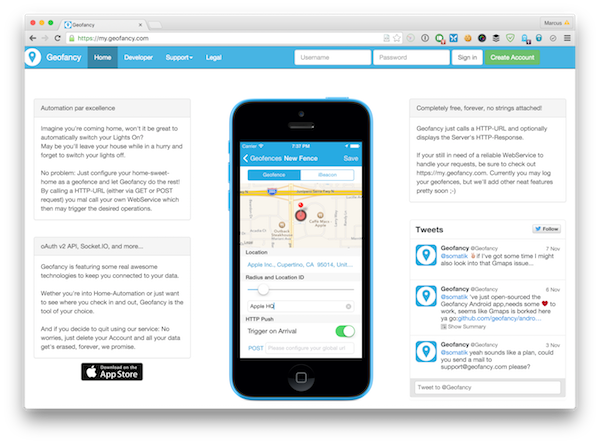

# Geofancy Cloud App


## Preamble

I'm open sourcing this side-project of mine as I'm not enough time to actively care about it and due to the high number of requests I've got from the community, it feels about right to make further work to it possible.

#### So you're going open source now, what about my data, is it also going open source?
No, no, no. Of course not, you're data is still stored on the Geofancy servers and it will stay there until further notice. No third party will have access to your data.

## Technologies used

This is a NodeJS app and the main backbone of this cloud app are Express, MongoDB and Redis.
For the numerous modules used take a look at the `package.json`.

## Development

To get started with this app first create a copt of `config.example.json` and name it `config.json` then customize this config to suit your needs, the rest is just convenient node.js stuff.

```
npm install
node app.js
```

That's all folks.

## Deployment

To date I'm going to manually deploy releases to production, I'm planning on migrating this project to Travis-CI so CI can do the deployments for me.

#### So how do I find out what version is currently running on my.geofancy.com?
Too easy! Just do any arbitrary HTTP request to any endpoint (e.g. GET https://my.geofancy.com) and look at the response headers: `X-Git-Revision: 7faa150`.

## Issues

Right now I'm still getting issues / feature requests etc. reported via UserVoice but I'm planning on moving to GitHub issues with this.

## The Geofancy License

Copyright (c) 2013-today Marcus Kida

Permission is hereby granted, free of charge, to any person obtaining a copy
of this software and associated documentation files (the "Software"), to deal
in the Software without restriction, including without limitation the rights
to use, copy, modify, merge, publish, distribute, sublicense, and/or sell
copies of the Software, and to permit persons to whom the Software is
furnished to do so, subject to the following conditions:

The above copyright notice and this permission notice shall be included in
all copies or substantial portions of the Software.

You are not eligible to distribute this Software under the name or appearance
of Geofancy, you may release it under another name and appearance though.

THE SOFTWARE IS PROVIDED "AS IS", WITHOUT WARRANTY OF ANY KIND, EXPRESS OR
IMPLIED, INCLUDING BUT NOT LIMITED TO THE WARRANTIES OF MERCHANTABILITY,
FITNESS FOR A PARTICULAR PURPOSE AND NONINFRINGEMENT.  IN NO EVENT SHALL THE
AUTHORS OR COPYRIGHT HOLDERS BE LIABLE FOR ANY CLAIM, DAMAGES OR OTHER
LIABILITY, WHETHER IN AN ACTION OF CONTRACT, TORT OR OTHERWISE, ARISING FROM,
OUT OF OR IN CONNECTION WITH THE SOFTWARE OR THE USE OR OTHER DEALINGS IN
THE SOFTWARE.
